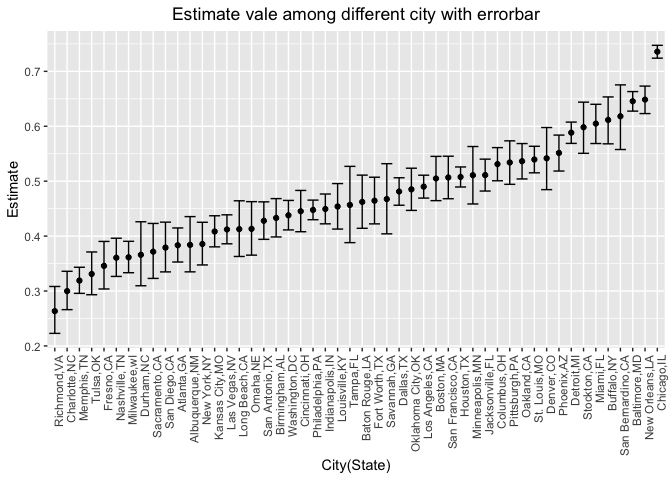
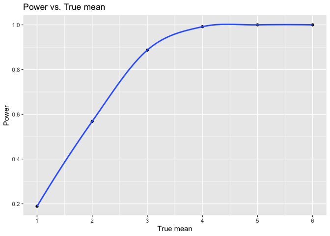
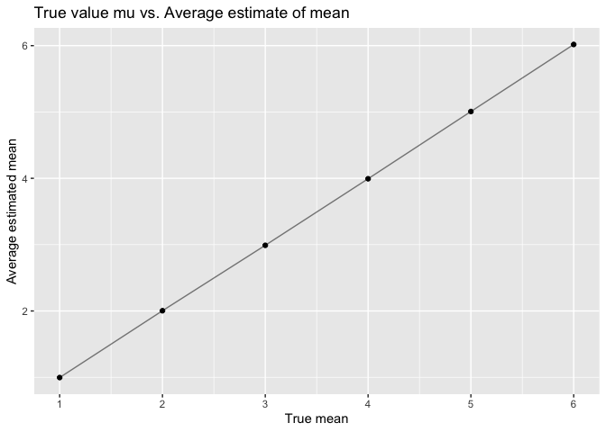
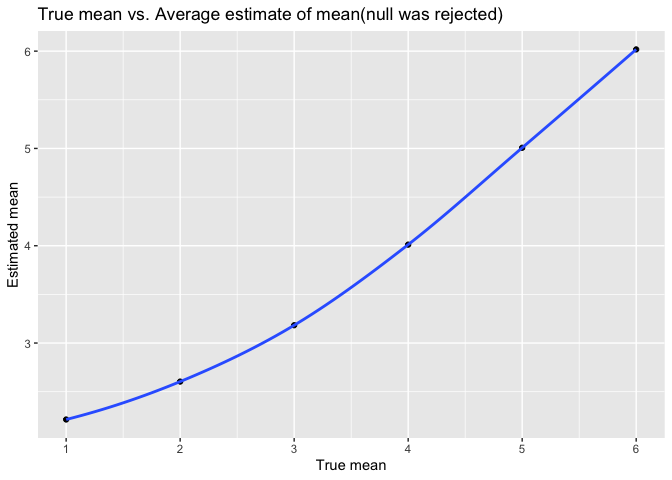

p8105_hw5_wm2473
================
2022-11-14

``` r
library(tidyverse)
```

    ## ── Attaching packages ─────────────────────────────────────── tidyverse 1.3.2 ──
    ## ✔ ggplot2 3.3.6      ✔ purrr   0.3.5 
    ## ✔ tibble  3.1.8      ✔ dplyr   1.0.10
    ## ✔ tidyr   1.2.1      ✔ stringr 1.4.1 
    ## ✔ readr   2.1.3      ✔ forcats 0.5.2 
    ## ── Conflicts ────────────────────────────────────────── tidyverse_conflicts() ──
    ## ✖ dplyr::filter() masks stats::filter()
    ## ✖ dplyr::lag()    masks stats::lag()

``` r
library(readxl)
library(rvest)
```

    ## 
    ## Attaching package: 'rvest'
    ## 
    ## The following object is masked from 'package:readr':
    ## 
    ##     guess_encoding

``` r
library(ggplot2)
set.seed(1)
```

Problem 2

``` r
#Describe the raw data: For the homicides raw dataset, it contains 52179 observations and 12 variables (columns), which are respectively uid, reported_date, victim_last, victim_first, victim_race, victim_age, victim_sex, city, state, latitude, longtitude, disposition. There are some NA missing value in latitude and longtitude column. Also, in the columns "race", "age" and "sex" contains data unknown which can indeciate that the person information is still misiing. There is a place Tulsa, one of the data is not in OK but in AL state. 

hd = read_csv("homicide-data.csv") %>% 
  janitor::clean_names() %>% 
  na.omit() %>% 
   mutate(city_state = str_c(city,",", state), 
         homicides = case_when(disposition == "Closed without arrest" ~ "unsolved homicides", disposition == "Open/No arrest" ~ "unsolved homicides", disposition == "Closed by arrest" ~ "solved homicides")) %>%
  filter(city_state != "Tulsa,AL") %>% 
  relocate(city_state)
```

    ## Rows: 52179 Columns: 12
    ## ── Column specification ────────────────────────────────────────────────────────
    ## Delimiter: ","
    ## chr (9): uid, victim_last, victim_first, victim_race, victim_age, victim_sex...
    ## dbl (3): reported_date, lat, lon
    ## 
    ## ℹ Use `spec()` to retrieve the full column specification for this data.
    ## ℹ Specify the column types or set `show_col_types = FALSE` to quiet this message.

``` r
hd %>% 
  group_by(city_state, homicides) %>% 
  count() %>% 
  knitr::kable()
```

| city_state        | homicides          |    n |
|:------------------|:-------------------|-----:|
| Albuquerque,NM    | solved homicides   |  231 |
| Albuquerque,NM    | unsolved homicides |  144 |
| Atlanta,GA        | solved homicides   |  600 |
| Atlanta,GA        | unsolved homicides |  373 |
| Baltimore,MD      | solved homicides   | 1002 |
| Baltimore,MD      | unsolved homicides | 1825 |
| Baton Rouge,LA    | solved homicides   |  228 |
| Baton Rouge,LA    | unsolved homicides |  196 |
| Birmingham,AL     | solved homicides   |  453 |
| Birmingham,AL     | unsolved homicides |  346 |
| Boston,MA         | solved homicides   |  303 |
| Boston,MA         | unsolved homicides |  309 |
| Buffalo,NY        | solved homicides   |  202 |
| Buffalo,NY        | unsolved homicides |  318 |
| Charlotte,NC      | solved homicides   |  481 |
| Charlotte,NC      | unsolved homicides |  206 |
| Chicago,IL        | solved homicides   | 1462 |
| Chicago,IL        | unsolved homicides | 4073 |
| Cincinnati,OH     | solved homicides   |  385 |
| Cincinnati,OH     | unsolved homicides |  309 |
| Columbus,OH       | solved homicides   |  506 |
| Columbus,OH       | unsolved homicides |  573 |
| Dallas,TX         | solved homicides   |  813 |
| Dallas,TX         | unsolved homicides |  754 |
| Denver,CO         | solved homicides   |  143 |
| Denver,CO         | unsolved homicides |  169 |
| Detroit,MI        | solved homicides   | 1037 |
| Detroit,MI        | unsolved homicides | 1482 |
| Durham,NC         | solved homicides   |  175 |
| Durham,NC         | unsolved homicides |  101 |
| Fort Worth,TX     | solved homicides   |  294 |
| Fort Worth,TX     | unsolved homicides |  255 |
| Fresno,CA         | solved homicides   |  316 |
| Fresno,CA         | unsolved homicides |  167 |
| Houston,TX        | solved homicides   | 1444 |
| Houston,TX        | unsolved homicides | 1489 |
| Indianapolis,IN   | solved homicides   |  728 |
| Indianapolis,IN   | unsolved homicides |  594 |
| Jacksonville,FL   | solved homicides   |  571 |
| Jacksonville,FL   | unsolved homicides |  597 |
| Kansas City,MO    | solved homicides   |  704 |
| Kansas City,MO    | unsolved homicides |  486 |
| Las Vegas,NV      | solved homicides   |  806 |
| Las Vegas,NV      | unsolved homicides |  565 |
| Long Beach,CA     | solved homicides   |  222 |
| Long Beach,CA     | unsolved homicides |  156 |
| Los Angeles,CA    | solved homicides   | 1151 |
| Los Angeles,CA    | unsolved homicides | 1106 |
| Louisville,KY     | solved homicides   |  314 |
| Louisville,KY     | unsolved homicides |  261 |
| Memphis,TN        | solved homicides   | 1031 |
| Memphis,TN        | unsolved homicides |  483 |
| Miami,FL          | solved homicides   |  294 |
| Miami,FL          | unsolved homicides |  450 |
| Milwaukee,wI      | solved homicides   |  712 |
| Milwaukee,wI      | unsolved homicides |  403 |
| Minneapolis,MN    | solved homicides   |  179 |
| Minneapolis,MN    | unsolved homicides |  187 |
| Nashville,TN      | solved homicides   |  484 |
| Nashville,TN      | unsolved homicides |  273 |
| New Orleans,LA    | solved homicides   |  504 |
| New Orleans,LA    | unsolved homicides |  930 |
| New York,NY       | solved homicides   |  384 |
| New York,NY       | unsolved homicides |  241 |
| Oakland,CA        | solved homicides   |  439 |
| Oakland,CA        | unsolved homicides |  508 |
| Oklahoma City,OK  | solved homicides   |  346 |
| Oklahoma City,OK  | unsolved homicides |  326 |
| Omaha,NE          | solved homicides   |  240 |
| Omaha,NE          | unsolved homicides |  169 |
| Philadelphia,PA   | solved homicides   | 1677 |
| Philadelphia,PA   | unsolved homicides | 1359 |
| Phoenix,AZ        | solved homicides   |  410 |
| Phoenix,AZ        | unsolved homicides |  504 |
| Pittsburgh,PA     | solved homicides   |  294 |
| Pittsburgh,PA     | unsolved homicides |  337 |
| Richmond,VA       | solved homicides   |  316 |
| Richmond,VA       | unsolved homicides |  113 |
| Sacramento,CA     | solved homicides   |  235 |
| Sacramento,CA     | unsolved homicides |  139 |
| San Antonio,TX    | solved homicides   |  476 |
| San Antonio,TX    | unsolved homicides |  356 |
| San Bernardino,CA | solved homicides   |  105 |
| San Bernardino,CA | unsolved homicides |  170 |
| San Diego,CA      | solved homicides   |  285 |
| San Diego,CA      | unsolved homicides |  174 |
| San Francisco,CA  | solved homicides   |  327 |
| San Francisco,CA  | unsolved homicides |  336 |
| Savannah,GA       | solved homicides   |  131 |
| Savannah,GA       | unsolved homicides |  115 |
| St. Louis,MO      | solved homicides   |  770 |
| St. Louis,MO      | unsolved homicides |  902 |
| Stockton,CA       | solved homicides   |  178 |
| Stockton,CA       | unsolved homicides |  265 |
| Tampa,FL          | solved homicides   |  113 |
| Tampa,FL          | unsolved homicides |   95 |
| Tulsa,OK          | solved homicides   |  390 |
| Tulsa,OK          | unsolved homicides |  193 |
| Washington,DC     | solved homicides   |  756 |
| Washington,DC     | unsolved homicides |  589 |

estimate the unsolved proportion of homicides in Baltimore, MD

``` r
Baltimore = hd %>%
  filter(city_state == "Baltimore,MD") %>%  
  summarise(
    unsolved = sum(homicides == "unsolved homicides"),
    n = n()
  )

Baltimore_test = 
  prop.test(
    x = Baltimore %>% pull(unsolved),
    n = Baltimore %>% pull(n))

Baltimore_test %>% 
  broom::tidy() 
```

    ## # A tibble: 1 × 8
    ##   estimate statistic  p.value parameter conf.low conf.high method        alter…¹
    ##      <dbl>     <dbl>    <dbl>     <int>    <dbl>     <dbl> <chr>         <chr>  
    ## 1    0.646      239. 6.46e-54         1    0.628     0.663 1-sample pro… two.si…
    ## # … with abbreviated variable name ¹​alternative

Prop.test for each of the city

``` r
city_proptest = function(city_df){
  city_summarize = city_df %>%
  summarise(
    unsolved = sum(homicides == "unsolved homicides"),
    n = n())
  
  city_test = 
  prop.test(
    x = city_summarize %>% pull(unsolved),
    n = city_summarize %>% pull(n))
  
  return(city_test)
}
```

Create a tidy dataframe with estimated proportions and CIs for each city

``` r
nested_df = hd %>%
  nest(alldata = uid:homicides) %>% 
  mutate(
    test_results = map(alldata, city_proptest),
    cleanresults = map(test_results, broom::tidy)
  ) %>% 
  select(city_state, cleanresults) %>% 
  unnest(cleanresults) %>% 
  select(city_state, estimate, starts_with("conf"))
```

Creat the plot

``` r
nested_df %>% 
  mutate(city_state = fct_reorder(city_state, estimate)) %>%
  ggplot(aes(x = city_state, y = estimate)) +
  geom_point()+geom_errorbar(aes(ymin = conf.low, ymax = conf.high))+
  theme(axis.text.x = element_text(angle = 90, hjust = 1), 
        plot.title = element_text(hjust = 0.5)) +
  labs(title = "Estimate vale among different city with errorbar",
       x = "City(State)",
       y = "Estimate") 
```

<!-- -->

Problem 3 t_test function

``` r
norm_and_t_test = function(mu) {
  sim_data = tibble(
    x = rnorm(n = 30, mean = mu, sd = 5),
  )  
    t.test(sim_data, mu =0, conf.level = 0.95, alternative = "two.sided") %>%
    broom::tidy() %>% 
    select(estimate, p.value)
}
```

testing mean=0

``` r
sim_reuslt_df_0=
  expand_grid(
    true_mean=0,
    iter=1:5000)%>%
  mutate(results=map(true_mean,norm_and_t_test))%>%
  unnest(results)
head(sim_reuslt_df_0)
```

    ## # A tibble: 6 × 4
    ##   true_mean  iter estimate p.value
    ##       <dbl> <int>    <dbl>   <dbl>
    ## 1         0     1    0.412  0.629 
    ## 2         0     2    0.664  0.368 
    ## 3         0     3    0.551  0.534 
    ## 4         0     4    0.567  0.487 
    ## 5         0     5   -1.65   0.0599
    ## 6         0     6    1.19   0.229

using the function for mean=1,2,3,4,5,6

``` r
sim_results_df = 
  expand_grid(
    mu = c(1, 2, 3, 4, 5, 6),
    iter = 1:5000) %>% 
  mutate(results = map(mu, norm_and_t_test)) %>% 
  unnest(results)
head(sim_results_df)
```

    ## # A tibble: 6 × 4
    ##      mu  iter estimate p.value
    ##   <dbl> <int>    <dbl>   <dbl>
    ## 1     1     1    1.52   0.0865
    ## 2     1     2    2.11   0.0159
    ## 3     1     3    2.01   0.0183
    ## 4     1     4    0.165  0.839 
    ## 5     1     5    0.108  0.912 
    ## 6     1     6    1.56   0.0682

First plot(mu vs. proportion of reject)

``` r
mu_prop = sim_results_df %>% 
  mutate(decision = case_when(p.value < 0.05 ~ "reject", p.value >= 0.05 ~ "fail_to_reject")) %>% 
  group_by(mu) %>% 
  summarize(n_obs = n(), prop_reject = sum(decision == "reject") / n_obs)%>%
  ggplot(aes(x = mu, y = prop_reject)) + geom_point() +geom_smooth(alpha = .5)+labs(title = "Power vs. True mean",x = "True mean", y = "Power")+scale_x_continuous(breaks = 1:6)

mu_prop
```

    ## `geom_smooth()` using method = 'loess' and formula 'y ~ x'

    ## Warning in simpleLoess(y, x, w, span, degree = degree, parametric =
    ## parametric, : Chernobyl! trL>n 6

    ## Warning in simpleLoess(y, x, w, span, degree = degree, parametric =
    ## parametric, : Chernobyl! trL>n 6

    ## Warning in sqrt(sum.squares/one.delta): NaNs produced

    ## Warning in stats::qt(level/2 + 0.5, pred$df): NaNs produced

    ## Warning in max(ids, na.rm = TRUE): no non-missing arguments to max; returning
    ## -Inf

<!-- -->

``` r
# Describe the association between effect size and power: The power in the x-axis is we calculating the proportion of times the null was rejected (p_value < 0.05). The effect size in the y-axis is our true mean from 1 to 6. From the graph, we can see that the power will increase when the effect size increase. There is a positively proportional relationship between the effect size and power. 
```

Second graph (true value mu vs. average estimate of mu)

``` r
true_estimate = sim_results_df %>% 
  mutate(decision = case_when(p.value < 0.05 ~ "reject", p.value >= 0.05 ~ "fail_to_reject")) %>% 
  group_by(mu) %>% 
  summarize(average_estimate = mean(estimate)) %>% 
  ggplot(aes(x = mu, y = average_estimate)) +
  geom_point()+ geom_line(alpha = .5)+ labs(title = "True value mu vs. Average estimate of mean",
    x = "True mean",
    y = "Average estimated mean"
  )+scale_x_continuous(breaks = 1:6)
true_estimate  
```

<!-- -->

Third graph (true mean vs. average estimate of mu only only in samples
for which the null was rejected)

``` r
sd = sim_results_df %>% 
  mutate(decision = case_when(p.value < 0.05 ~ "reject", p.value >= 0.05 ~ "fail_to_reject")) %>% 
  filter(decision == "reject") %>%
  group_by(mu) %>% 
  summarize(average_estimate = mean(estimate), null_reject = sum(p.value)) %>% 
  ggplot(aes(x = mu, y = average_estimate))+ geom_point()+
  geom_smooth()+ labs(title="True mean vs. Average estimate of mean(null was rejected)",
         x="True mean",
         y="Estimated mean")+scale_x_continuous(breaks = 1:6)
sd
```

    ## `geom_smooth()` using method = 'loess' and formula 'y ~ x'

    ## Warning in simpleLoess(y, x, w, span, degree = degree, parametric =
    ## parametric, : Chernobyl! trL>n 6

    ## Warning in simpleLoess(y, x, w, span, degree = degree, parametric =
    ## parametric, : Chernobyl! trL>n 6

    ## Warning in sqrt(sum.squares/one.delta): NaNs produced

    ## Warning in stats::qt(level/2 + 0.5, pred$df): NaNs produced

    ## Warning in max(ids, na.rm = TRUE): no non-missing arguments to max; returning
    ## -Inf

<!-- -->

``` r
# Is the sample average of the observed mu across tests for which the null is rejected approximately equal to the true value of mu? Why or why not?
# For comparing two graphs, we can see that the true mean 4, 5, 6 has a similar output for both estimate and observed mean. We found that the true mean 1, 2 and 3 is a little bit overestimated than the observed one. So the sample average of the observed mu across tests for which the null is rejected is not a good approximation of the true mean. We can also look at the p_value in the test results which is significant (significant different from the estimated mean and the true mean), we can reject the null from this result. 
```
